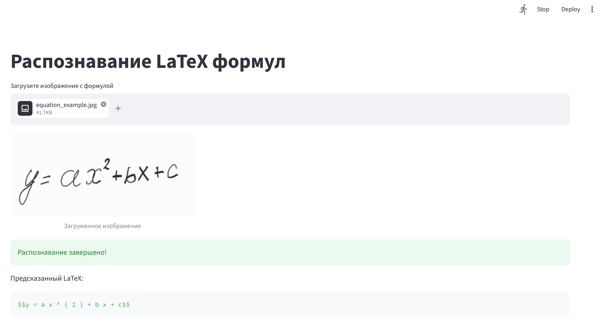

# VLMLaTeXOCR
Vision-language model that converts handwritten formulas into LaTeX format.

## Overview
This project leverages a Vision-Language Model (VLM), specifically `Qwen/Qwen3-VL-2B-Instruct`, to perform Optical Character Recognition (OCR) on handwritten mathematical formulas, converting them directly into LaTeX code.

## Features
- **Inference**: *Zero-shot* and *one-shot* inference to quickly test VLM capabilities on mathematical datasets.
- **Fine-Tuning**: Parameter-Efficient Fine-Tuning (PEFT) using *LoRA*.
- **Metrics**: *Word Error Rate (WER)* and *Character Error Rate (CER)* on
normalized LaTeX.
- **Datasets**: `linxy/LaTeX_OCR` and `deepcopy/MathWriting-human` datasets and their combination.
- **Prediction**: Predict LaTeX for the **.jpg** with an equation using
one-shot inference.

## Project structure
The source code is located in `src/vlmlatexocr/`:
- `data.py`: Utilities for downloading, caching, mixing datasets, and data_collator for fine-tuning.
- `model.py`: Functions for inference (`test_zero_shot_inference`, `test_one_shot_inference`) and fine-tuning (`run_lora`).
- `metrics.py`: Calculation of WER and CER metrics.
- `cli.py`: Command Line Interface built with `click`.

## Configuration
Model parameters, system prompts, data cache locations, and device configurations are managed via JSON files (e.g., `configs/model.json`).

## Usage
The project includes a Command Line Interface (CLI) built with `click`.

### Fine-tuning with LoRA
To run Supervised Fine-Tuning (SFT) using LoRA:
```bash
poetry run python src/vlmlatexocr/cli.py lora latex_ocr --frac 0.1
```

### Zero-shot inference evaluation
To evaluate the base model on a dataset using zero-shot inference:
```bash
poetry run python src/vlmlatexocr/cli.py test-zero-shot latex_ocr --num-samples 200
```

### One-shot inference evaluation
To evaluate the model using one-shot inference, providing one example in the prompt:
```bash
poetry run python src/vlmlatexocr/cli.py test-one-shot latex_ocr --num-samples 200
```

### Prediction with one-shot inference
To predict LaTeX for the **.jpg** with an equation using one-shot inference:
```bash
poetry run python src/vlmlatexocr/cli.py predict equation_example.jpg
```

## Interim results

Now, WER and CER values are extremely high. There may be a critical bug in
metrics calculation and evaluation procedures.

### Zero-shot inference evaluation

| Dataset                    | WER  | CER  |
|----------------------------|------|------|
| linxy/LaTeX_OCR            | 0.45 | 0.41 |
| deepcopy/MathWriting-human | 1.36 | 1.47 |
| mixed dataset              | 0.84 | 1.07 |

### One-shot inference evaluation

| Dataset                    | WER  | CER  |
|----------------------------|------|------|
| linxy/LaTeX_OCR            | 0.45 | 0.42 |
| deepcopy/MathWriting-human | 1.36 | 1.47 |
| mixed dataset              | 0.88 | 0.88 |

### LoRA fine-tuning (3 epochs)

| Dataset                | WER  | CER  | Loss |
|------------------------|------|------|------|
| linxy/LaTeX_OCR - val  | 0.70 | 1.62 | 0.19 |
| linxy/LaTeX_OCR - test | 0.70 | 1.65 | 0.17 |

## Streamlit app with One-shot inference


